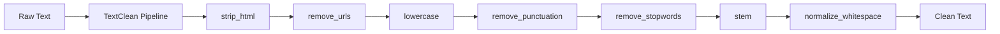
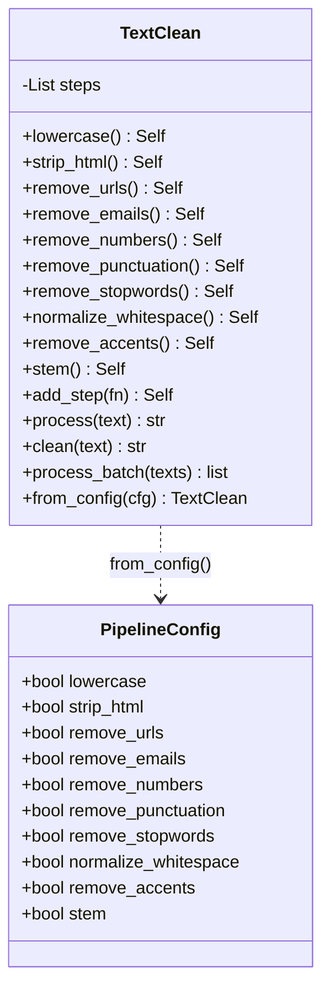

# TextClean

[](https://github.com/officethree/TextClean/actions/workflows/ci.yml)
[](https://www.python.org/downloads/)
[](LICENSE)

A Python library for cleaning and normalizing text data with composable pipeline steps.

## Architecture





## Quickstart

### Installation

```bash
pip install -e .
```

### Usage

```python
from textclean import TextClean

# Build a pipeline with chained steps
cleaner = (
    TextClean()
    .lowercase()
    .strip_html()
    .remove_urls()
    .remove_punctuation()
    .remove_stopwords()
    .normalize_whitespace()
)

text = '<p>Visit https://example.com for MORE info!</p>'
print(cleaner.process(text))
# => "visit info"

# Process multiple texts at once
results = cleaner.process_batch(["<b>Hello</b> World!", "Testing 123..."])
```

### Config-driven pipeline

```python
from textclean import TextClean, PipelineConfig

config = PipelineConfig(
    lowercase=True,
    strip_html=True,
    remove_urls=True,
    normalize_whitespace=True,
)
cleaner = TextClean.from_config(config)
print(cleaner.process("<h1>Hello</h1>"))
# => "hello"
```

### Custom steps

```python
from textclean import TextClean

cleaner = (
    TextClean()
    .lowercase()
    .add_step(lambda t: t.replace("foo", "bar"), name="foo_to_bar")
    .normalize_whitespace()
)
```

## Development

```bash
make dev      # install with dev dependencies
make test     # run tests
make lint     # lint with ruff
make fmt      # format with ruff
```

## Inspiration

Inspired by NLP preprocessing and text cleaning trends.

---

Built by [Officethree Technologies](https://officethree.com) | Made with love and AI
